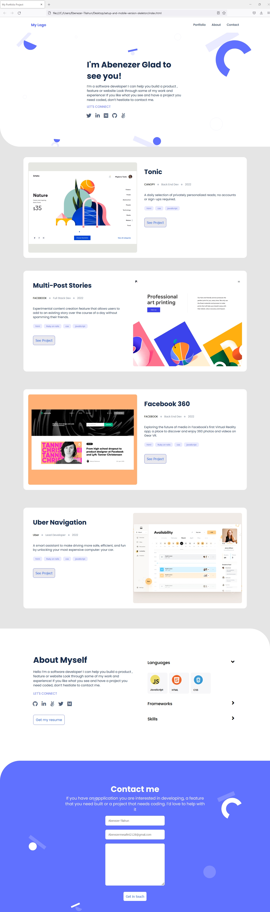

# Personal Portfolio:setup Desktop version 

> This is the Desktop version  of developing my portfolio as a microverse student with Mobile skeleton setup using basic HTML5 tag, CSS3, using forms with HTML5 validations, applying User Experience (UX) and linters!!!

Additional description about the project and its features.

## Built With

- Major languages:HTML5 and CSS3 Font awesome HTML5 and CSS3 linters
- Frameworks
- Technologies used

## Live Demo

[Live Demo Link](https://abenezer-tilahun.github.io/Microverse-Portfolio-Website/)

## Get Started

- Clone the repo by using (git clone https://github.com/Abenezer-Tilahun/setup-and-mobile-version-skeleton.git)
- Nagivate to the directory by using (cd your-project/)
- Follow the HTML-CSS linters confuguration to setup linters [Link to Microverse linter docs](https://github.com/microverseinc/linters-config/tree/master/html-css)
To get a local copy up and running follow these simple example steps.

## Authors

👤 **Author1**

- GitHub: [@githubhandle](https://github.com/Abenezer-Tilahun)
- Twitter: [@twitterhandle](https://twitter.com/AbenezerTilah11)
- LinkedIn: [LinkedIn](linkedin.com/in/abenezer-tilahun-4b4b43137)

## 🤝 Contributing

Contributions, issues, and feature requests are welcome!

Feel free to check the [issues page](../../issues/).

## Show your support

Give a ⭐️ if you like this project!

## Acknowledgments

- Microverse
- Figma
- My coding partners(@jbrime15)
)

## 📝 License

This project is [MIT](./MIT.md) licensed.
